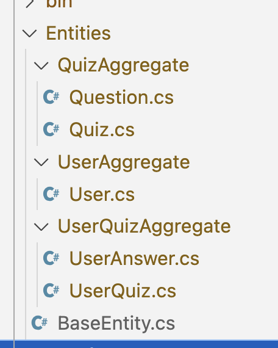

## Summary about this Challenge

Work load: 
- Analyze requirement and choose a good solution: 1h
- Coding: 4h
- Write Diagram and report: 2h

Missing on Coding: 
- Unit Test for application
- Refactor 
- Implement the Infrastrure 

## Part 1: System Design

### Overal Architecture : Event Streaming Microserices 

#### Architecture Overview Diagram 


#### Component Description:

1. On Devices: Mobile App (.Net MAUI : Android & iOS) & Web App (.Net Blazor)

1. API Gateway (.net Core 8): 
    - manage (CRUD) Quiz, User, UserParticipate (UserQuiz)... 
    - Data save on PosgreSQL (RMDS)
    - calculate points and trigger UserAnswers event to KSQL 

1. KSQL (streaming Database) which realtime process based on event from #1 and push updates to UI  
    - Save events to UserAnser topic when users submit answers of UserQuiz
    - realtime process the score calculation of UserQuiz and save event to UserQuiz topic, which update the UserQuiz Material View
    - realtime update the LeaderBoard's Material View
    - push update to UI ( Device App) about Score Update, and LeaderBoard 

1. Kafka: High performance and Infinite Storage , profile topics for KSQL 
    - long-life data such as : UserAnsers, UserQuiz, ... 
    - and more User's Interactive: such as, click, back,...
  
1. Confluent Cloud: [reference](https://www.confluent.io/streaming-data-pipelines/) a Data Streaming Platform, includes KSQL, Kafka,... Apache Flink
    - Advanced solution for large-scale Streaming Appcation and Data Platform
    - run on multiple clouds and on premise
    - easy to intergrate with M/S

#### Data Flow: 

Explain how data flows through the system from when a user joins a quiz to when the leaderboard is updated.

1. When a user join a quiz, insert or update the UserQuiz table on PostgreSQL, return userQuizId

1. When an answer of a question is submitted, 
   1. insert new event with UUID and `{userQuizId, questionId, answer, score}`. Value of `score` could be calculate before submit, or after submited by a Realtime Calculation, integrated with KSQL
   1. Calculate Score by Sum of Score of UserAnswer's score of this `userQuizId`
   1. Insert event to `UserQuizResult` to topic, it will push update to MaterialViews of ScoreUpdate and LeaderQuiz (the leader board of a quiz);

1. More Flow: update Global LeaderBoard 
   1. when the User completed a Quiz, calculate total Score of User, compare with other Users on LeaderBoard 

#### Technologies and Tools: 

- backend: .net 8, c#, EF, PostgreSQL
- Confluent Cloud with KSQL, Kafka,
- More with Confluent
    - Snowflake for Big Data Driven Culture 
    - Apache Flink for complex - realtime processing
    - Machine Learning Plugin
    - ChatGPT plutings 

### Implementation 

#### Clean Architecture & Domain Driven Design 


Advantages 
1.Independent of Frameworks.
2.Testable.
3.Independent of UI.
4.Independent of Database.
5.Independent of any external agency
##### Entities:


. QuizAggregate :
  + Quiz has one-many Question
  + Question has many Answer (object valu)
. UserAggregate: registered User

. UserQuizAggregate: A quiz have users joined 
  + UserQuiz have many UserAnswers : 
  
##### Interfaces (And Services)


### Requirements for the Implemented Component:
- Real-time Quiz Participation: Users should be able to join a quiz session using a unique quiz ID.
- Real-time Score Updates: Users' scores should be updated in real-time as they submit answers.
```
public interface IUserQuizService
{
    public UserQuiz JoinQuiz(int userId, int quizId);

    public bool SubmitAnswer(UserQuiz userQuiz, Question question, Answer answers);
    public int ScoreUpdate(int userQuizId);
}
```

- Real-time Leaderboard: A leaderboard should display the current standings of all participants in real-time.
```
public interface IQuizService
{
  public IList<User> LeaderBoard(Quiz quiz); 
  public IList<User> LeaderBoard(); 
}
```


### Build For the Future:

1. Clean Architecture :- for complex business login in future
    - **Maintainability**:
1. Event Streaming Microservices with Confluent Cloud is for
    - **Scalability**: 
    - **Performance**: 
    - **Reliability**: 
    - **Monitoring and Observability**:
